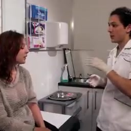

In out [work](https://arxiv.org/abs/2103.10699) we concatenate training parts of many popular datasets. The single large training dataset is created.
It is important to be sure that there is not intersection between resulting large training dataset and original test sets.

We manually intersected by embeddings test parts of MSRVTT (full split), LSMDC (publictest) and ActivityNet (val1+val2) with
all datasets mentioned in table below. Numbers in cells represent how many pairs we managed to find in intersection between two given datasets.

| | ActivityNet | LSMDC | MSRVTT |
|---|---|---|---|
|ActivityNet|181|0|12|
|LSMDC|0|-|17|
|MSRVTT|8|0|281|
|MSVD|1|1|1|
|TGIF|0|0|8|
|TwitterVines|0|0|3|
|YouCook2|10|0|34|
|Kinetics700|235|0|1|
|HowTo100M|-|-|21|

Sign `-` means that due to lack of human resources we do not find intersection between given pair of datasets.

In this work we try to find duplicates and pseudo duplicates.  

We say that video segments S1 and S2 are duplicates if
the same content is present on both of them. S1 and S2 may have different aspect ratio, brightness, presence/absence of logo,
S1 and S2 may be two different crops from the same video segment or may have different quality. For example.

 

We say that two video segments S1, S2 are pseudo duplicates if very similar things are present on both of them.
For example: the same background and the same person are presented on both S1 and S2. The example of pseudo duplicate
(the first one from ActivityNet val, the second one from ActivityNet train) are depicted on figures below.

In `lists` sub folder we present all found duplicates. The filenames have format: `<TestDataset>_<TrainDataset>.lst`.
Each line has structure : `<test_video_id>\t<start1>\t<end1>\t<train_video_id>\t<start2>\t<end2>\n`.
Values `<start1>`, `<start2>`, `<end1>`, `<end2>` are time in second where duplicate segment starts and ends.

For some duplicate pairs start, end offsets may be incorrect. In this case duplicate segment can be
5-10 second left or right.

